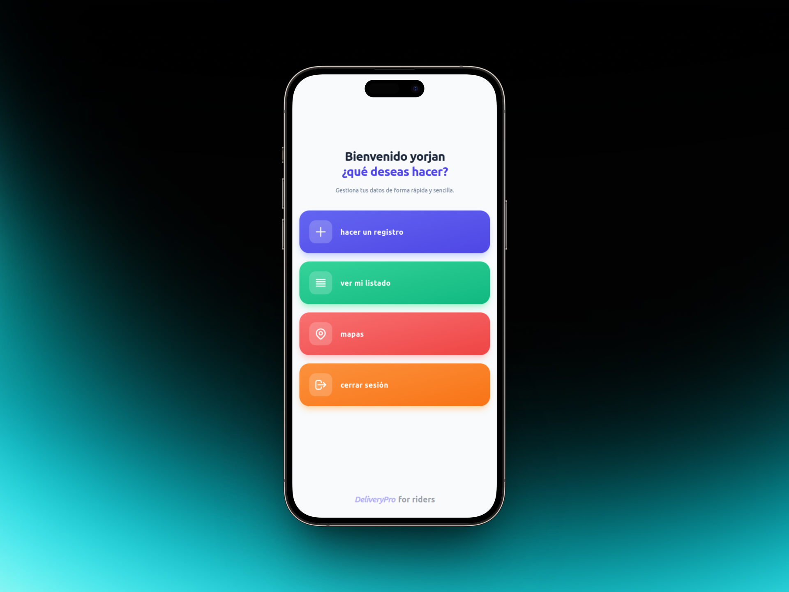

# [DProRider]

Una aplicación móvil desarrollada en **Flutter** que funciona como un WebView optimizado para empaquetar y mostrar un sitio web como una aplicación nativa en Android e iOS.
<br>

---

## 🚀 Características

* **Navegación Fluida:** Integración de WebView de alto rendimiento con soporte para JavaScript, almacenamiento local y cookies.
* **Indicador de Carga:** Barra de progreso o spinner visual mientras la página web se está cargando.
* **Soporte Gestual:** Control de navegación hacia adelante y hacia atrás mediante gestos o botones nativos.
* **Control de Conectividad:** Pantalla de error amigable integrada en caso de que el usuario no tenga conexión a Internet.
* **Pantalla de Bienvenida (Splash Screen):** Inicio de marca limpio antes de cargar el sitio web.

---

## 🛠️ Tecnologías y Paquetes Utilizados

* [Flutter SDK](https://flutter.dev) (Canal Stable)
* [webview_flutter](https://pub.dev/packages/webview_flutter) - Para la renderización del sitio web.
* [connectivity_plus](https://pub.dev/packages/connectivity_plus) - (Opcional) Para comprobar el estado de la red.

---

## 📋 Requisitos Previos

Antes de comenzar, asegúrate de tener instalado tu entorno de desarrollo:

* **Flutter SDK:** `>=3.0.0` (o la versión que uses)
* **Dart SDK:** `>=3.0.0`
* **Android Studio** / **Xcode** (para emular/compilar)

---

## ⚙️ Configuración del Proyecto

### 1. Clonar el repositorio
```bash
git clone [https://github.com/tu-usuario/tu-repositorio.git](https://github.com/tu-usuario/tu-repositorio.git)
cd tu-repositorio